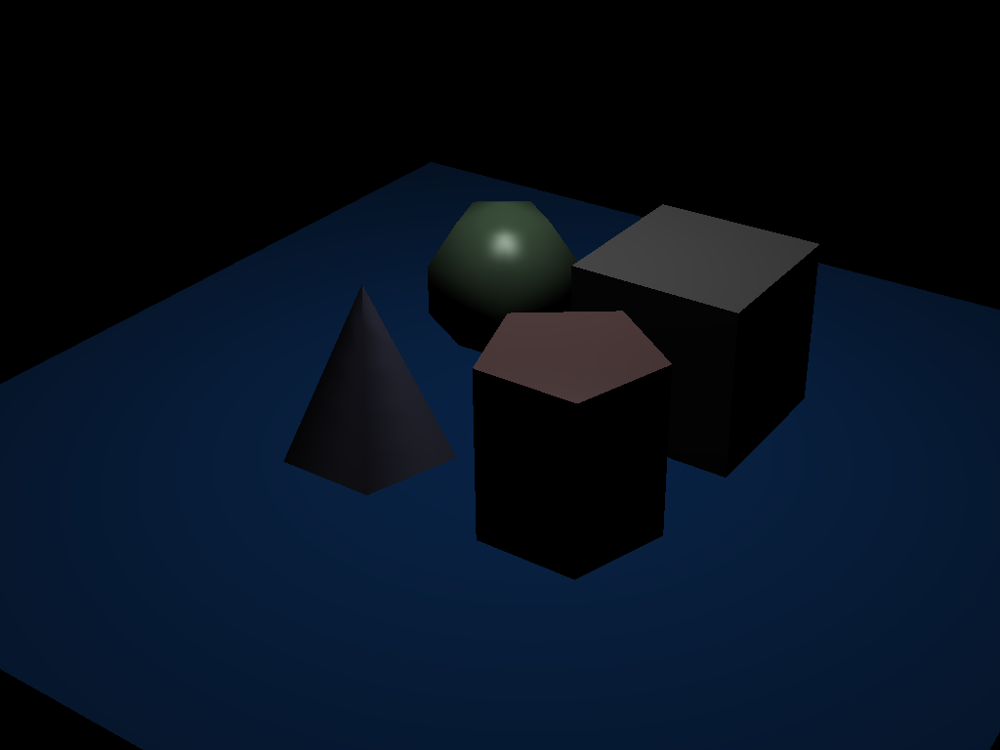
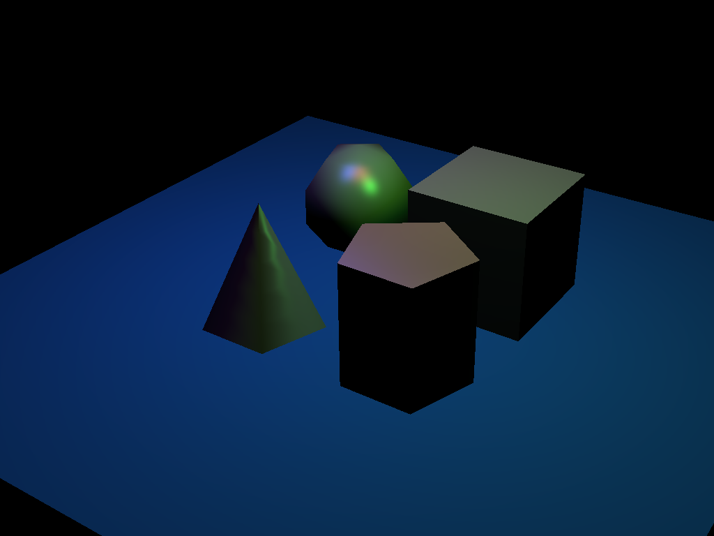
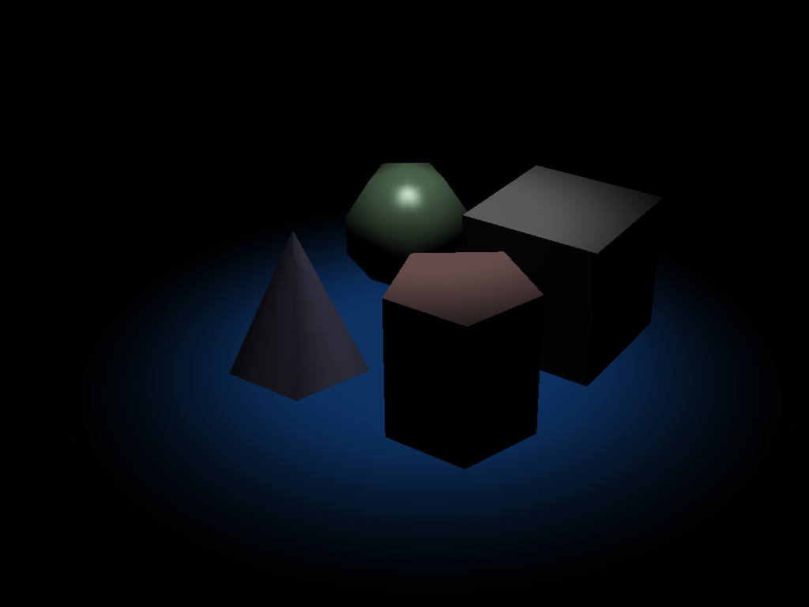
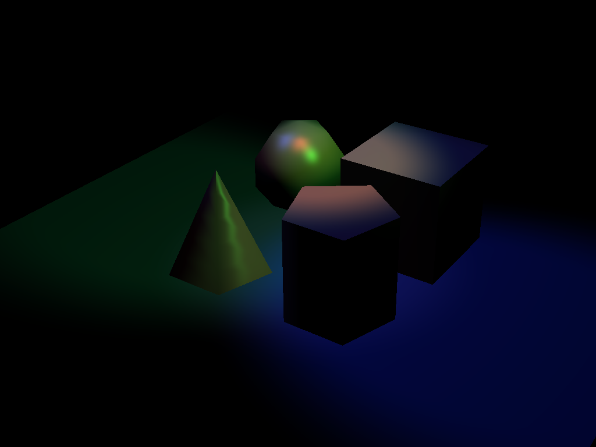
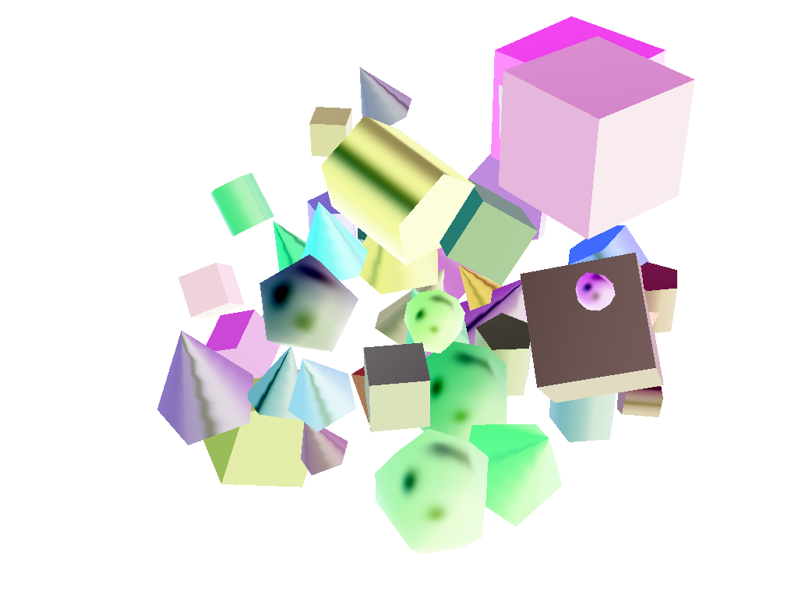
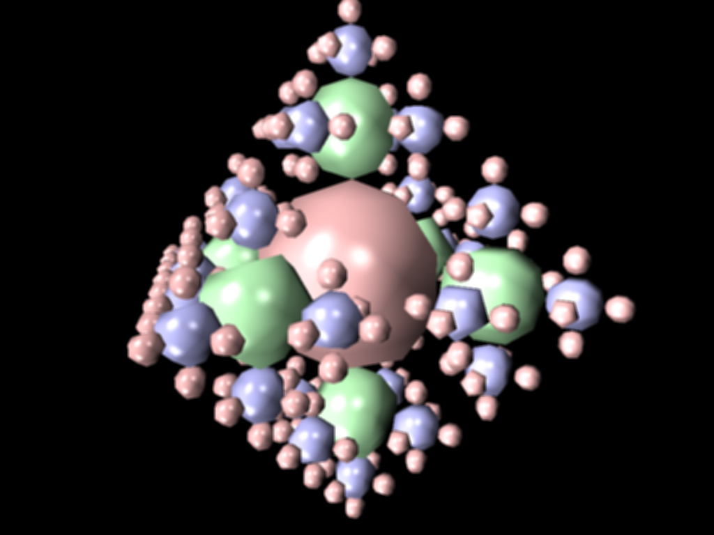

## Project 6: Action!

Please fill this out for Action! only. The project handout can be found [here](https://cs1230.graphics/projects/realtime/2).

### Output Comparison

> [!IMPORTANT]
> Before generating expected outputs, make sure to:
>
> 1. Set your working directory to the project directory
> 2. From the project directory, run `git submodule update --recursive --remote` to update the `scenefiles` submodule.
> 3. Change all instances of `"lights-camera"` in `mainwindow.cpp` to `"action"` (there should be 2 instances, one in `MainWindow::onUploadFile` and one in `MainWindow::onSaveImage`).

Run the program, open the specified `.json` file and follow the instructions to set the parameters.

If the output you are generating is an image, save the image with the specified file name using the "Save image" button in the UI. Be sure to follow the instructions in the left column to set the file name. Once you save the images, they will appear in the table below.

If the output you are generating is a video, reference the [Screen Recording Guide](https://cs1230.graphics/docs/screen-recording) to capture a video of the specified interaction. Once you've recorded everything, navigate to this template file in Github, click edit, and either select or drag-and-drop each of your videos into the correct location. This will upload them to GitHub (but not include them in the repo) and automatically embed them into this Markdown file by providing a link. Make sure to double-check that they all show up properly in the preview.

We're **not** looking for your video to **exactly** match the expected output (i.e. draw the exact same shape). Just make sure to follow the instructions and verify that the recording fully demonstrates the functionality of that part of your project.

> [!NOTE]
> There may be issues with the image saving functionality, and the images may not save the exact same way as the expected outputs. This is acceptable, as long as your output demonstrates correct functionality.

#### Point and Spot Lights

|                                File/Method To Produce Output                                 |                                                Expected Output                                                 |                                                       Your Output                                                       |
| :------------------------------------------------------------------------------------------: | :------------------------------------------------------------------------------------------------------------: | :---------------------------------------------------------------------------------------------------------------------: |
| Input: `point_light_1.json` Output: `point_light_1.png` Parameters: (5, 5, 0.1, 100) |  |  |
| Input: `point_light_2.json` Output: `point_light_2.png` Parameters: (5, 5, 0.1, 100) |  |  |
| Input: `spot_light_1.json` Output: `spot_light_1.png`  Parameters: (5, 5, 0.1, 100)  |   |    |
|  Input: `spot_light_2.json` Output: `spot_light_2.png` Parameters: (5, 5, 0.1, 100)  |   |    |

#### Invert

> [!NOTE]
> If you did not implement the invert filter, you can skip this section.

|                                                      File/Method To Produce Output                                                      |                                                      Expected Output                                                      |                                                                  Your Output                                                                  |
| :-------------------------------------------------------------------------------------------------------------------------------------: | :-----------------------------------------------------------------------------------------------------------------------: | :-------------------------------------------------------------------------------------------------------------------------------------------: |
| Input: `primitive_salad_1.json` **Apply invert filter** Output: `primitive_salad_1_invert.png` Parameters: (5, 5, 0.1, 100) |  |  |

#### Grayscale

> [!NOTE]
> If you did not implement the grayscale filter, you can skip this section.

|                                                         File/Method To Produce Output                                                         |                                                       Expected Output                                                        |                                                                     Your Output                                                                     |
| :-------------------------------------------------------------------------------------------------------------------------------------------: | :--------------------------------------------------------------------------------------------------------------------------: | :-------------------------------------------------------------------------------------------------------------------------------------------------: |
| Input: `primitive_salad_1.json` **Apply grayscale filter** Output: `primitive_salad_1_grayscale.png` Parameters: (5, 5, 0.1, 100) |  |  |

> [!WARNING]
> Kernel-based filters might not work the same on different devices. This is explained in more detail in the project handout. If your output doesn't seem to quite match our output but you think your implementation is correct, be sure to let your mentor know.

#### Sharpen

> [!NOTE]
> If you did not implement the sharpen filter, you can skip this section.

|                                                        File/Method To Produce Output                                                        |                                                       Expected Output                                                       |                                                                    Your Output                                                                    |
| :-----------------------------------------------------------------------------------------------------------------------------------------: | :-------------------------------------------------------------------------------------------------------------------------: | :-----------------------------------------------------------------------------------------------------------------------------------------------: |
| Input: `recursive_sphere_4.json` **Apply sharpen filter** Output: `recursive_sphere_4_sharpen.png` Parameters: (5, 5, 0.1, 100) |  |  |

#### Blur

> [!NOTE]
> If you did not implement the blur filter, you can skip this section.

|                                                     File/Method To Produce Output                                                     |                                                     Expected Output                                                      |                                                                 Your Output                                                                 |
| :-----------------------------------------------------------------------------------------------------------------------------------: | :----------------------------------------------------------------------------------------------------------------------: | :-----------------------------------------------------------------------------------------------------------------------------------------: |
| Input: `recursive_sphere_4.json` **Apply blur filter** Output: `recursive_sphere_4_blur.png` Parameters: (5, 5, 0.1, 100) |  |  |

#### Camera Translation

_Instructions:_ Load `chess.json`. For about 1 second each in this order, press:

- <kbd>W</kbd>, <kbd>A</kbd>, <kbd>S</kbd>, <kbd>D</kbd> to move in each direction by itself
- <kbd>W+A</kbd> to move diagonally forward and to the left
- <kbd>S+D</kbd> to move diagonally backward and to the right
- <kbd>Space</kbd> to move up
- <kbd>Cmd/Ctrl</kbd> to move down

##### Expected Output

https://github.com/BrownCSCI1230/projects_realtime_template/assets/45575415/710ff8b4-6db4-445b-811d-f6c838741e67

##### Your Output

https://github.com/user-attachments/assets/8ad78024-5b4f-4f92-8cb0-5d907507a453

<!---
Paste your output on top of this comment!
-->

#### Camera Rotation

_Instructions:_ Load `chess.json`. Take a look around!

##### Expected Output

https://github.com/BrownCSCI1230/projects_realtime_template/assets/45575415/a14f4d32-88ee-4f5f-9843-74dd5c89b9dd

##### Your Output

https://github.com/user-attachments/assets/a998e35c-382e-452a-b104-aeb085b2ae1f

<!---
Paste your output on top of this comment!
-->

### Design Choices
- Used VAO/VBO architecture for shape rendering
- Implemented post-processing effects such as inversion and blur.
- Tessellation based on shape parameters
- Supports ambient, diffuse, and specular for Phong lighting
- Supports translational and rotational camera movement

Please also include in your README how TAs can change it's value since depending on the OS, we may require a different default FBO value in order to draw to the screen for our TA machines:
- same as in lab11. In initializeGL() there is a variable m_defaultFBO currently equal to 2 but feel free to change it to your needs

### Collaboration/References
chatGPT
- used to understand how i might get the size of the texture for my blur implementation. it suggested to use     glGetTexLevelParameteriv(GL_TEXTURE_2D, 0, GL_TEXTURE_WIDTH, &texWidth) to get width and height which I wasnt aware of previously
- conceptually understanding rotational camera movement

### Known Bugs
n/a

note: my invert picture looks different because I just zoomed out (s key) before I saved it. it was cropping weirdly so I thought it would be better to just zoom out so you could see everything clearly. this isn't a bug since everything is still correct I just wanted to explain why it looked different.

### Extra Credit
n/a
